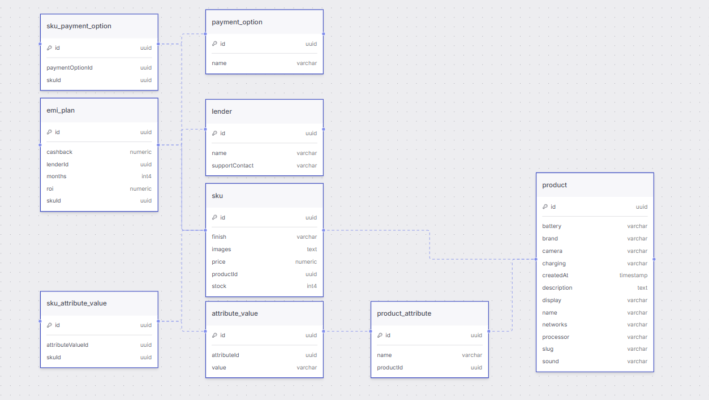

# Mini-Order-System

A full-stack application for managing products, variants (SKUs), and financing options (EMI).

## Tech Stack

### Frontend
- **Framework**: React 19 (Vite)
- **Styling**: Tailwind CSS 4
- **State Management**: Zustand
- **Routing**: React Router 7
- **HTTP Client**: Axios

### Backend
- **Framework**: NestJS
- **ORM**: TypeORM
- **Database**: PostgreSQL
- **Documentation**: Swagger (available at `/api`)
- **Validation**: Class-validator, Class-transformer

---

## Schema Overview

The database uses PostgreSQL with TypeORM. Key entities include:

- **Product**: General product information (Name, Brand, Technical Specs).
- **Sku (Stock Keeping Unit)**: Specific variants of a product with unique pricing, stock, and images.
- **ProductAttribute**: Defines categories for variants (e.g., Color, Storage).
- **AttributeValue**: Specific values for attributes.
- **EmiPlan**: Financing options linked to SKUs, including duration (months), ROI, and cashback.
- **Lender**: Financial institutions providing EMI plans.
- **PaymentOption**: Supported payment methods (e.g., Credit Card, UPI).

---

## API Endpoints

### 1. Products

#### `GET /products`
Fetch all products with a summary of their variants.
- **Response Format**: `Array<ProductSummary>`
- **Example Response**:
```json
[
  {
    "productId": "79b323c6-...",
    "name": "iPhone 15 Pro",
    "brand": "Apple",
    "defaultSkuId": "b6a7...",
    "defaultImage": "https://example.com/image.jpg",
    "price": 999.99,
    "maxDiscountPercent": 0,
    "availableColors": ["Natural Titanium", "Blue Titanium"],
    "availableStorages": ["128GB", "256GB"]
  }
]
```

#### `GET /products/:id`
Fetch full details of a specific product and all its SKUs (variants).
- **Response Format**: `ProductDetail`
- **Example Response**:
```json
{
  "productId": "79b323c6-...",
  "name": "iPhone 15 Pro",
  "brand": "Apple",
  "description": "The latest iPhone with Titanium design...",
  "processor": "A17 Pro",
  "battery": "3274 mAh",
  "charging": "20W Wired",
  "networks": "5G, LTE",
  "camera": "48MP Main",
  "display": "6.1-inch OLED",
  "sound": "Stereo Speakers",
  "skus": [
    {
      "skuId": "b6a7...",
      "storage": "128GB",
      "color": "Natural Titanium",
      "finish": "Titanium",
      "price": 999.99,
      "stock": 45,
      "images": ["url1", "url2"],
      "emiPlans": [
        {
          "lender": "HDFC Bank",
          "months": 12,
          "roi": 14.5,
          "cashback": 2000
        }
      ],
      "paymentOptions": ["Credit Card", "Debit Card", "UPI"]
    }
  ]
}
```

#### `POST /products/add-product`
Create a new product with its attributes and variants.
- **Request Body**: `AddProductDto`
```json
{
  "name": "Galaxy S24 Ultra",
  "slug": "galaxy-s24-ultra",
  "brand": "Samsung",
  "description": "AI-powered flagship",
  "attributes": [
    { "name": "Color", "values": ["Titanium Gray", "Titanium Black"] },
    { "name": "Storage", "values": ["256GB", "512GB"] }
  ],
  "skus": [
    {
      "storage": "256GB",
      "color": "Titanium Gray",
      "price": 129999,
      "stock": 100,
      "emiPlans": [
        { "lender": "ICICI", "months": 6, "roi": 0, "cashback": 5000 }
      ],
      "paymentOptions": ["Net Banking", "UPI"]
    }
  ]
}
```
- **Response**: `{ "message": "Product created successfully", "productId": "uuid" }`

#### `PUT /products/:id`
Update existing product details.
- **Request Body**: `Partial<AddProductDto>`
- **Response**: Updated `ProductDetail` object.

---

### 2. EMI Plans

#### `GET /emi-plan/:skuId`
Get all financing options for a specific variant.
- **Response Format**: `Array<EmiPlan>`
- **Example Response**:
```json
[
  {
    "id": "emi-uuid",
    "months": 12,
    "roi": 15,
    "cashback": 1500,
    "lender": {
      "id": "lender-uuid",
      "name": "Axis Bank"
    }
  }
]
```

---

## Setup and Run

### Prerequisites
- **Node.js**: v18+
- **PostgreSQL**: Running instance

### Backend Setup
1. Navigate to the `server` directory: `cd server`
2. Install dependencies: `npm install`
3. Create a `.env` file based on `.env.example` (or configure your DB settings):
   ```env
   DATABASE_HOST=localhost
   DATABASE_PORT=5432
   DATABASE_USER=postgres
   DATABASE_PASSWORD=yourpassword
   DATABASE_NAME=mini_order_system
   ```
   OR
   ```env
   DATABASE_URL=dburl
   ````
4. Run in development mode: `npm run start:dev`

### Frontend Setup
1. Navigate to the `client` directory: `cd client`
2. Install dependencies: `npm install`
3. Run the development server: `npm run dev`
4. Access the app at `http://localhost:5173`
